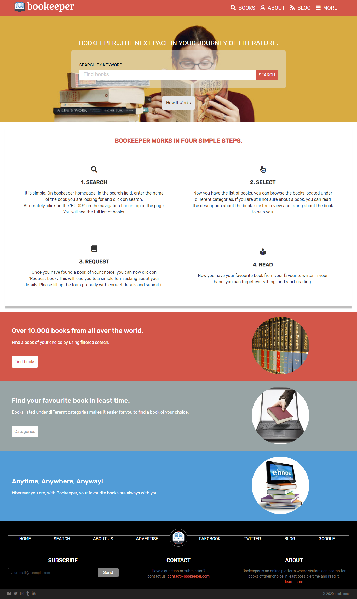

# HTML & CSS Capstone-project
This repository is created for the HTML & CSS capstone project as a part of Microverse Inc. curriculum. This project is based on an online directory of schools> But the project has been personalised and instead of directory of schools I have made a online directory of books. The [original design](https://www.behance.net/gallery/25563385/PatashuleKE) can be seen here.

# Screenshot
This is the screenshot of my work.

# Built With
* HTML 5
* CSS 3
* Visual Studio Code Editor

# Live Demo
[Here](https://raw.githack.com/praz99/HTML-CSS-Capstone-project/mainpage/index.html) is the live demo of my work.

## Getting Started

To get a local copy up and running follow these simple example steps.

### Prerequisites

- A compatible browser with HTML and CSS.

### Install

- Just clone the project

### Usage

- Open the index.html file in any browser or edit using Visual Code or the preference IDE for web development

# Author
### Prajwal Thapa
* Github: [@praz99](https://github.com/praz99)

# Contributing
Contributions, issues and feature requests are welcome!
Feel free to check the [issues](https://github.com/praz99/HTML-CSS-Capstone-project/issues) page.

## Show your support

Give a star if you like this project!

## Acknowledgments

- [Mathew Njuguna](https://www.behance.net/mathewnjuguna)
- [Sam Achola](https://www.behance.net/aweSam)

## License

This project is free to use as learning purposes. For any external content (e.g. logo, images, ...), please contact the proper author and check their license of use.
